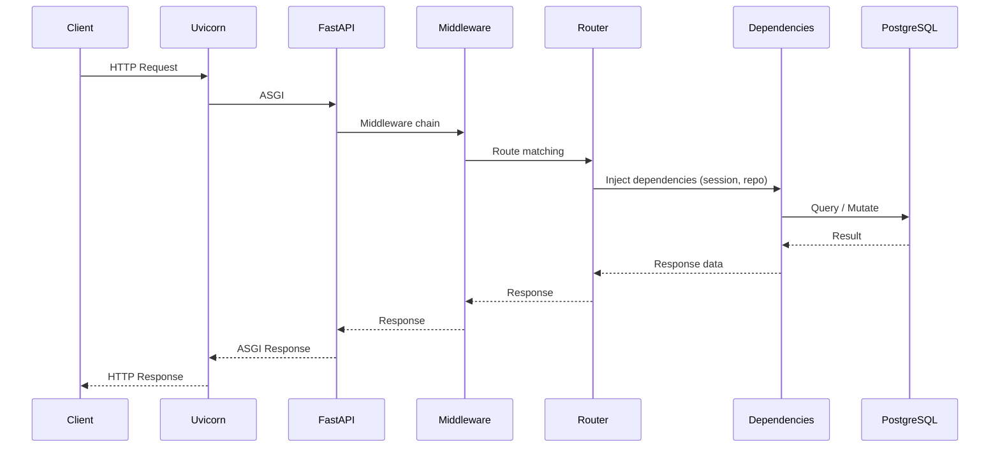
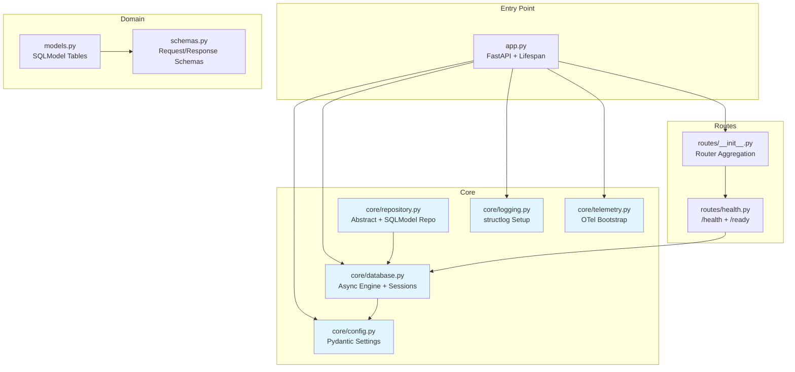
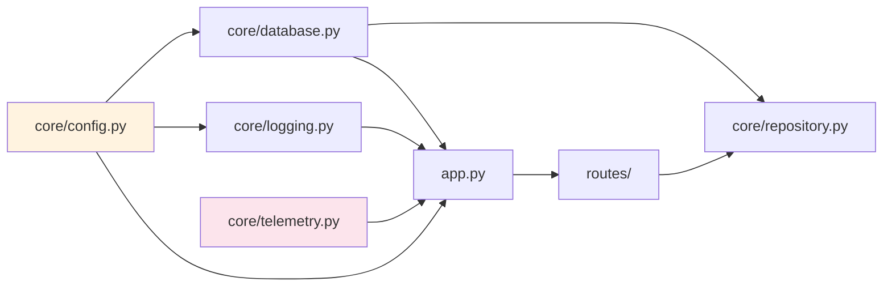
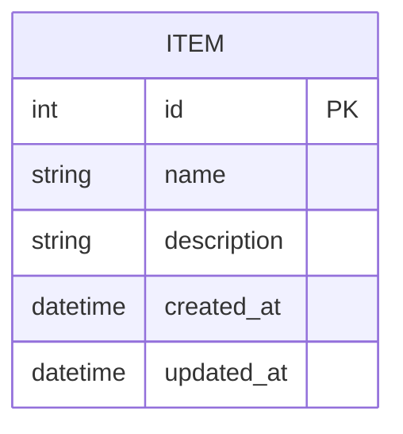
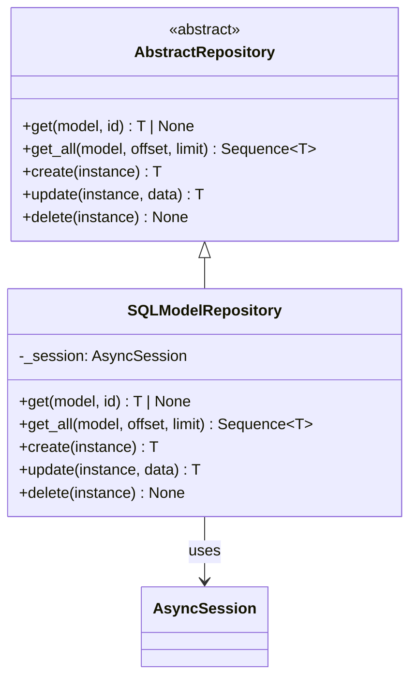
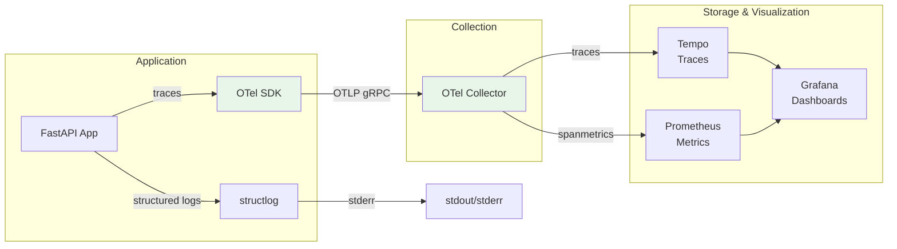

# Architecture

System architecture diagrams for query_scheduler.

## Request Lifecycle

## Application Structure

## Module Dependencies

**Key rule:** `core/config.py` is the leaf dependency. All modules import from it, it imports from nothing internal. `core/telemetry.py` reads `os.environ` directly to avoid import-order coupling.

## Database Schema

Extend this diagram as you add models.

## Repository Pattern

## Observability Pipeline

Enable with `OTEL_ENABLED=true` and `docker compose --profile otel up -d`.
